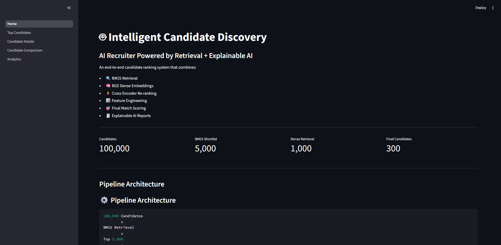
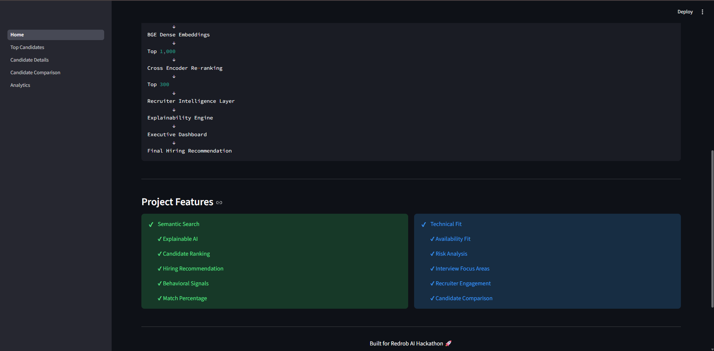
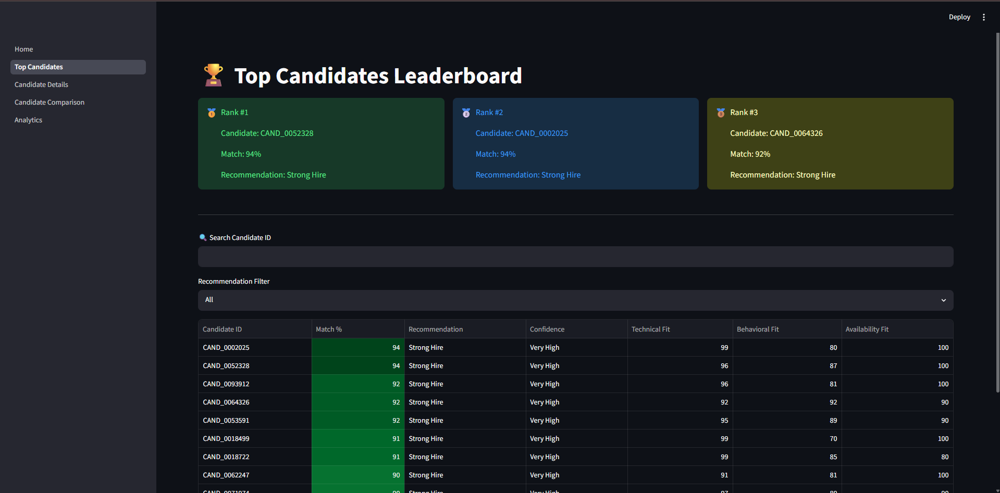
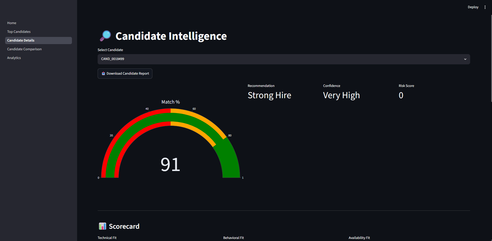
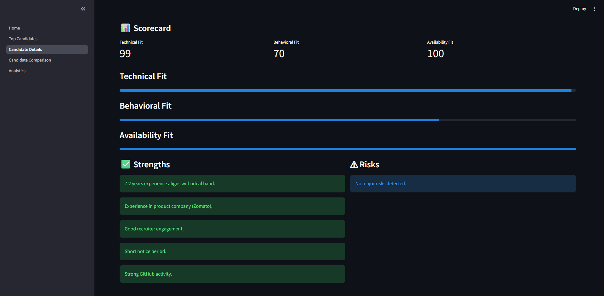
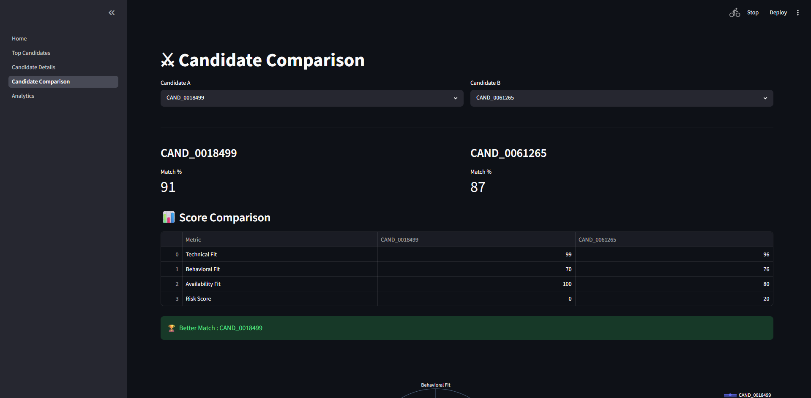
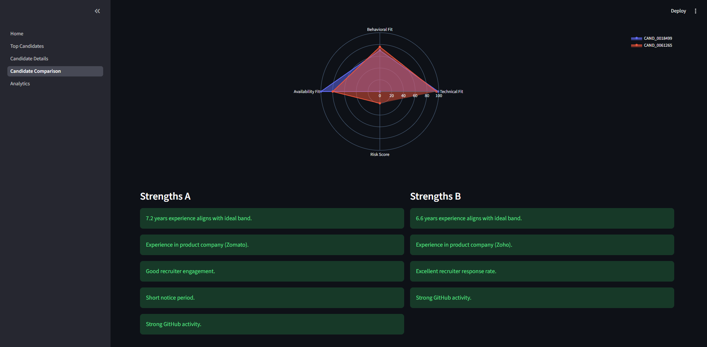
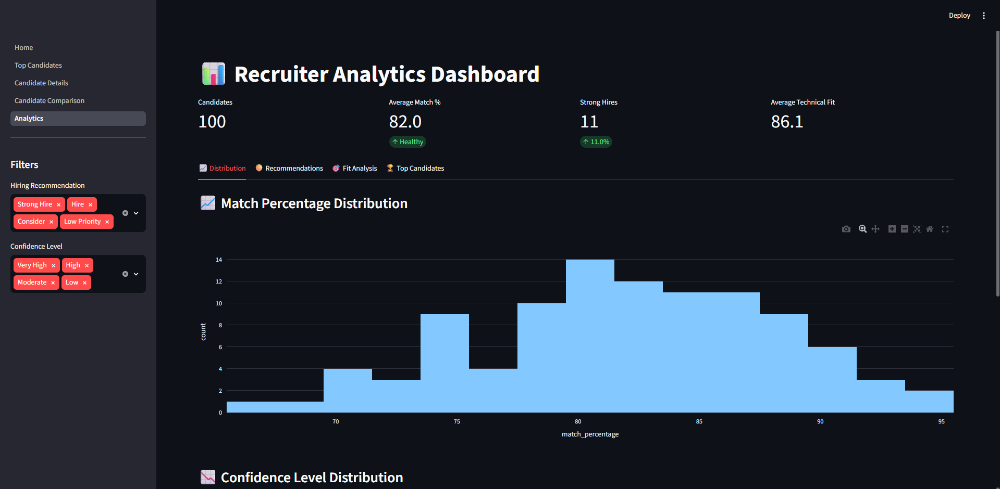
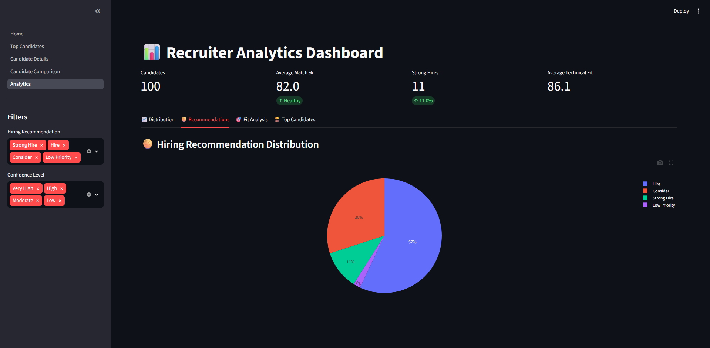
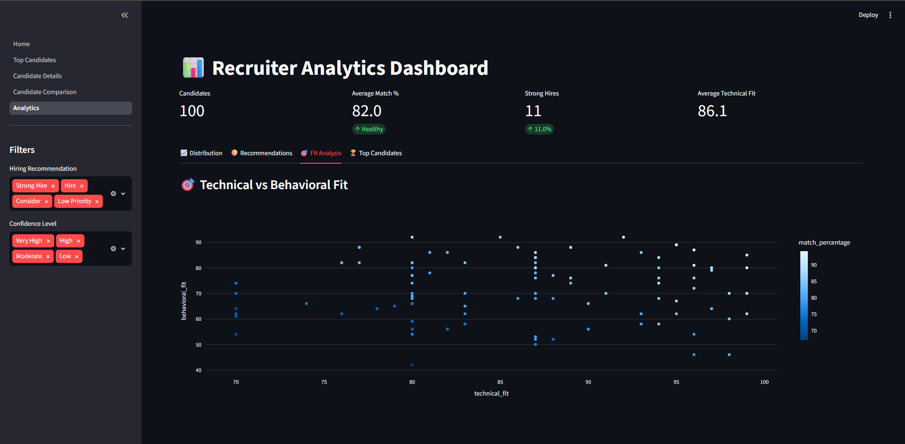

<div align="center">

# 🚀 Intelligent Candidate Discovery
### AI Recruiter Powered by Retrieval + Explainable AI

An end-to-end candidate ranking platform built for the **Redrob AI Hackathon**.

Combining:

🔎 BM25 Retrieval • 🧠 Dense Embeddings • ⚡ Cross Encoder Re-ranking • 📊 Explainable AI

---


</div>

---

# 📌 Problem Statement

Recruiters struggle to discover the best candidates from massive profile datasets.

Traditional keyword search often misses:

- Hidden talent
- Contextual relevance
- Behavioral signals
- Availability constraints
- Explainability

This project solves that by building an **AI-powered Candidate Intelligence Platform** that combines retrieval systems and explainable scoring.

---

# 💡 Why This Project?

Traditional applicant tracking systems rely heavily on keyword matching, making it difficult to identify high-potential candidates with transferable skills or contextual relevance.

This project combines hybrid retrieval, explainable AI, and conversational AI to provide recruiters with a faster, more transparent, and intelligent hiring workflow.

---

# 🏗 Architecture

```text
100,000 Candidates
        ↓
BM25 Retrieval
        ↓
Top 5,000
        ↓
Dense Embeddings
        ↓
Top 1,000
        ↓
Cross Encoder Re-ranking
        ↓
Top 300
        ↓
Recruiter Intelligence Layer
        ↓
Explainability Engine
        ↓
Executive Dashboard
        ↓
Hiring Recommendation
        ↓
User
      ↓
AI Recruiter Agent
      ↓
Gemini
      ↓
Intent Parser
      ↓
Tool Executor
      ↓
Candidate Database
      ↓
Streamlit Dashboard
```
---

# 🧠 AI Pipeline

User Query

↓

Gemini Intent Parsing

↓

Tool Selection

↓

Candidate Retrieval

↓

Ranking & Filtering

↓

Explainable Recommendation

↓

Streamlit Visualization

---

# ✨ Features

## 🔎 Candidate Ranking

- BM25 Retrieval
- Dense Embedding Search
- Cross Encoder Re-ranking
- Match Percentage Scoring

---

## 📊 Candidate Intelligence

- Technical Fit
- Behavioral Fit
- Availability Fit
- Risk Score
- Confidence Level
- Hiring Recommendation

---

## 🧠 Explainable AI

Each candidate receives:

✅ Strengths

⚠ Risks

📄 Executive Summary

🎯 Interview Focus Areas

---

## ⚔ Candidate Comparison

Compare candidates side-by-side using:

- Radar Charts
- Score Comparison
- Strength Analysis
- Better Match Recommendation

---

## 📈 Analytics Dashboard

Interactive dashboard with:

### Match Distribution

### Recommendation Distribution

### Technical vs Behavioral Fit

### Confidence Analysis

### Top Candidates Leaderboard

---

# 🤖 AI Recruiter Agent

Powered by Google Gemini.

Recruiters can interact naturally with the platform using conversational language.

Examples:

• Show top candidates

• Find Backend Engineers

• Find ML Engineers

• Show strong hires with low risk

• Why is CAND_0018499 recommended?

• Summarize CAND_0018499

• Compare CAND_0018499 and CAND_0061265

The AI Agent understands recruiter intent, invokes the appropriate retrieval tools, and generates explainable hiring recommendations.

---

# 🖥 Screenshots

---

## Home Page



---

## Pipeline Architecture



---

## Top Candidates



---

## Candidate Intelligence



---

## Explainable AI Report



---

## Candidate Comparison



---

## Radar Analysis



---

## Analytics Dashboard



---

## Recommendation Distribution



---

## Technical vs Behavioral Fit



---

# 📂 Project Structure

```text
redrob-ai-hackathon
│
|── app
|     │
|     ├── Home.py
|     │
|     ├── pages
|     │     ├── 1_Top_Candidates.py
|     │     ├── 2_Candidate_Details.py
|     │     ├── 3_Candidate_Comparison.py
|     │     ├── 4_Analytics.py
|     │     └── 5_AI_Recruiter.py
|     │
|     ├── agent
|     │     ├── gemini_agent.py
|     │     ├── recruiter_agent.py
|     │     ├── executor.py
|     │     ├── intent_parser.py
|     │     ├── prompts.py
|     │     └── tools.py
|     │
|     ├── utils
|     ├── data
|     ├── assets
│
├── data
├── reports
├── models
├── screenshots
├── notebooks
├── requirements.txt
└── README.md
```

---

# 📈 Scale

| Stage | Candidates |
|---------|------------|
| Initial Corpus | 100,000 |
| BM25 Retrieval | 5,000 |
| Dense Retrieval | 1,000 |
| Cross Encoder | 300 |
| Final Recommendation | Top Candidates |

---

# 🛠 Tech Stack

### Backend

- Python

### Data Processing

- Pandas
- NumPy

### Retrieval

- BM25
- BGE Embeddings
- Cross Encoder

### Visualization

- Plotly
- Streamlit

### Machine Learning

- Sentence Transformers
- Scikit-Learn

- Google Gemini API

- python-dotenv

- FAISS

- Rank-BM25

- Cross Encoder

- Sentence Transformers

---

# 🚀 Installation

Clone repository:

```bash
git clone https://github.com/Jeet-Lohar-29/redrob-ai-hackathon.git
```

Move inside:

```bash
cd redrob-ai-hackathon
```

Install dependencies:

```bash
pip install -r requirements.txt
```

---

# ▶ Run Application

```bash
streamlit run app/Home.py
```
## 🌐 Live Demo

**Streamlit App**

https://redrob-hack-recruiter.streamlit.app/

**GitHub Repository**

https://github.com/Jeet-Lohar-29/redrob-ai-hackathon

---

# 📊 Outputs

The system generates:

- Candidate Reports
- Match Scores
- Explainability Insights
- Risk Analysis
- Executive Summary
- Interview Focus Areas
- Analytics Dashboard

---

# 📊 Performance

✔ 100,000 candidate corpus

✔ Hybrid Retrieval (BM25 + Dense)

✔ Cross Encoder Re-ranking

✔ Explainable AI Reports

✔ Real-time Gemini Recruiter Agent

✔ Streamlit Cloud Deployment

---

# 🔮 Future Improvements

- Resume PDF Parsing
- Multi-job Support
- RAG-powered Recruiter Assistant
- LLM Chat Interface
- Real-time ATS Integration
- Candidate Q&A
- Semantic Resume Search

---

# 📄 License

Licensed under the MIT License.

---

## 👨‍💻 Author

**Jeet Lohar**

B.Tech Computer Science & Engineering

Minor in Data Science

GitHub: https://github.com/Jeet-Lohar-29

LinkedIn: https://www.linkedin.com/in/jeet-lohar

---

## 🙏 Acknowledgements

- Redrob AI Hackathon
- Hack2Skill
- Google Gemini
- Sentence Transformers
- Streamlit

---

# 🏆 Built For

## Redrob AI – India Runs Hackathon

### Intelligent Candidate Discovery

---

<div align="center">

⭐ If you like this project, give it a star!

</div>
